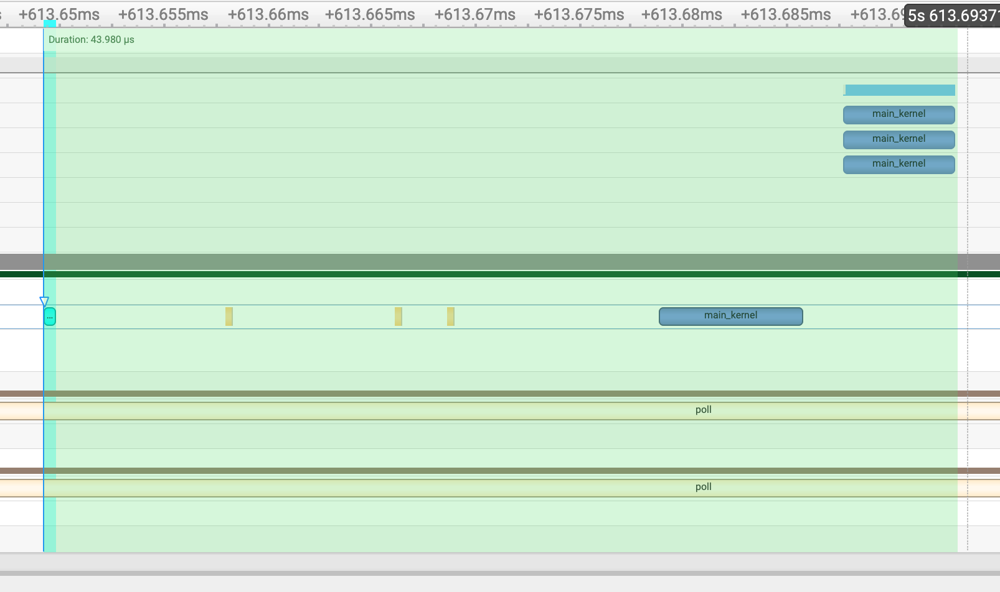
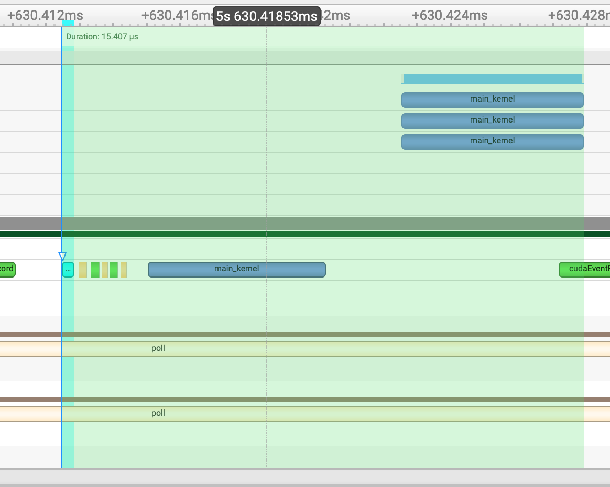

# CUDA Python Issue Reproduction

This repository contains a reproduction case for **performance comparison between CUDA Python and traditional CUDA C++ approaches** for kernel invocation. The project benchmarks two fundamentally different paradigms:

1. **CUDA Python approach**: Using `kernel.py` with precompiled `kernel.cubin` files via CUDA Python bindings
2. **Traditional CUDA C++ approach**: Using `libwrapped_kernel.so` with ctypes (standard C++ CUDA runtime)

## 🎯 Purpose

**The primary goal of this reproduction is to compare the performance overhead of CUDA API calls when using CUDA Python versus traditional CUDA C++ runtime.** This investigation aims to:

- Quantify the performance differences between CUDA Python bindings and traditional CUDA C++ approaches
- Analyze the overhead introduced by Python-based CUDA API calls
- Demonstrate real-world performance implications through controlled benchmarking

The repository includes performance timeline visualizations showing the execution patterns of both approaches:


*CUDA Python approach execution timeline*


*Traditional CUDA C++ approach execution timeline*

## 🏗️ Repository Structure

```
cuda-python-repro/
├── issue/                      # Main reproduction code
│   ├── main.py                 # Benchmark script comparing both approaches
│   ├── kernel.py               # Python wrapper for CUBIN kernel calls
│   ├── kernel.cu               # CUDA kernel source code
│   ├── wrapped_kernel.cu       # CUDA wrapper for shared library
│   ├── kernel.cubin            # Precompiled CUDA kernel (generated)
│   ├── libwrapped_kernel.so    # Shared library (generated)
│   ├── Makefile                # Build configuration
│   ├── Justfile                # Just build automation
│   └── tl_templates/           # Template files
├── 3rdparty/
│   └── cutlass/                # NVIDIA CUTLASS library (submodule)
├── pixi.toml                   # Pixi package manager configuration
├── pixi.lock                   # Locked dependencies
└── README.md                   # This file
```

## 🔧 Prerequisites

- **CUDA Toolkit**: Version 12.9 or compatible
- **GPU**: NVIDIA GPU with compute capability 9.0a (H100/H200 series)
- **Python**: 3.8 or higher
- **Pixi**: Package manager (recommended) or conda/pip

## 🚀 Quick Start

### Using Pixi (Recommended)

1. **Clone the repository with submodules**:
   ```bash
   git clone --recursive <repository-url>
   cd cuda-python-repro
   ```

2. **Install dependencies**:
   ```bash
   pixi install
   ```

3. **Build and run the benchmark**:
   ```bash
   cd issue
   pixi run just build benchmark
   ```

### Using Manual Setup

1. **Clone the repository**:
   ```bash
   git clone <repository-url>
   cd cuda-python-repro
   git submodule update --init --recursive
   ```

2. **Install dependencies**:
   ```bash
   pip install cuda-python>=12.9.0 torch
   ```

3. **Build and run**:
   ```bash
   cd issue
   # Compile CUDA kernels
   nvcc -gencode=arch=compute_90a,code=sm_90a -O3 -I. -I../3rdparty/cutlass/include -cubin -o kernel.cubin kernel.cu
   nvcc -gencode=arch=compute_90a,code=sm_90a -O3 -I. -I../3rdparty/cutlass/include -shared -Xcompiler -fPIC -o libwrapped_kernel.so wrapped_kernel.cu
   
   # Run benchmark
   python main.py
   ```

## 📊 Benchmark Details

The benchmark performs matrix multiplication operations using both kernel invocation methods:

- **Matrix Size**: 512×512 with half-precision (float16)
- **Iterations**: 100 benchmark runs with 10 warmup iterations
- **Timing**: Uses CUDA events for precise GPU timing
- **Metrics**: Reports total time, average time per call, and relative performance

### Expected Output

```
CUDA Kernel Benchmark: Comparing CUBIN vs Shared Library Approaches
======================================================================
Using CUDA device: NVIDIA H100 80GB HBM3
Python version: 3.12.10 | packaged by conda-forge | (main, Apr 10 2025, 22:21:13) [GCC 13.3.0]
NVCC version: cuda_12.9.r12.9/compiler.35813241_0
CUDA Python version: 12.9.0
Benchmarking CUBIN approach (kernel.py + kernel.cubin)...
Running 10 warmup iterations...
Running 100 benchmark iterations...
CUBIN approach - Total time: 0.003878s, Average time: 0.039ms

Benchmarking shared library approach (libwrapped_kernel.so)...
Running 10 warmup iterations...
Running 100 benchmark iterations...
Shared library approach - Total time: 0.001214s, Average time: 0.012ms

Performance Comparison:
------------------------------
Shared library approach is 3.19x faster
Time difference: 0.027ms per call
```

## 🛠️ Available Commands

Using Just (recommended):
```bash
just build          # Compile both CUBIN and shared library
just cubin          # Compile only CUBIN file
just so             # Compile only shared library
just benchmark      # Run the performance benchmark
just fmt            # Format Python code (requires isort and autopep8)
just clean          # Remove compiled artifacts
just profile        # Run the performance benchmark with nsys profiler
```

Using Make:
```bash
make all            # Build everything
make cubin          # Compile CUBIN
make so             # Compile shared library
make benchmark      # Run the performance benchmark
make fmt            # Format Python code (requires isort and autopep8)
make clean          # Clean artifacts
make profile        # Run the performance benchmark with nsys profiler
```

## 🔍 Key Components

### `main.py`
The main benchmark script that:
- Loads and initializes both kernel approaches
- Creates test tensors for matrix operations
- Measures performance using CUDA events
- Compares and reports results

### `kernel.py`
Python wrapper for CUBIN-based kernel invocation using CUDA driver API.

### `wrapped_kernel.cu`
C++ wrapper that provides a C interface for the CUDA kernel, compiled into a shared library.

### `kernel.cu`
The actual CUDA kernel implementation performing matrix multiplication.

## 🐛 Troubleshooting

### Common Issues

1. **CUDA not found**: Ensure CUDA toolkit is installed and `nvcc` is in PATH
2. **Architecture mismatch**: The code targets `sm_90a` (H100/H200). Modify `arch` and `code` variables in Justfile for other GPUs
3. **Memory errors**: Ensure sufficient GPU memory (at least 1GB recommended)
4. **Import errors**: Verify `cuda-python` and `torch` are properly installed

### Debug Mode

To enable verbose output and debugging:
```bash
CUDA_LAUNCH_BLOCKING=1 python main.py
```

## 📝 Dependencies

- **cuda-python**: >=12.9.0,<13 - CUDA Python bindings
- **pytorch-gpu**: >=2.7.0,<3 - PyTorch with CUDA support
- **cuda-toolkit**: >=12.9.0,<13 - NVIDIA CUDA Toolkit
- **CUTLASS**: NVIDIA CUTLASS library (submodule)

## 🤝 Contributing

This is a reproduction repository. If you encounter issues or have improvements:

1. Ensure your environment matches the prerequisites
2. Test with the provided benchmark
3. Document any modifications needed for different GPU architectures
4. Report findings with system specifications

## 📄 License

See [LICENSE](LICENSE) file for details.

## 🔗 Related Links

- [CUDA Python Documentation](https://nvidia.github.io/cuda-python/)
- [NVIDIA CUTLASS](https://github.com/NVIDIA/cutlass)
- [CUDA Toolkit Documentation](https://docs.nvidia.com/cuda/)
